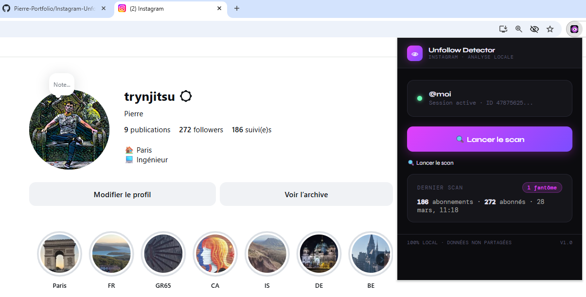

<h1 align="center">
  
</h1>


---

# Instagram Unfollow Detector

## Aperçu
Extension Chrome (Manifest V3) qui analyse ton compte Instagram et détecte les comptes que **tu suis mais qui ne te suivent pas en retour** (les « fantômes »). L'analyse est **100% locale** : l'extension réutilise ta session Instagram déjà ouverte dans l'onglet, compare tes abonnements à tes abonnés, et n'envoie **aucune donnée** vers un serveur tiers. Aucun mot de passe demandé, aucun backend.

## Fonctionnalités

### Scan
- Lancement du scan en un clic depuis le popup de l'extension
- **Communication par port long-vivant** entre le popup et le script de page (`chrome.tabs.connect`) : la progression est poussée en direct, sans polling
- Identification automatique du compte via le cookie de session `ds_user_id` (fallback : données de page, puis API `current_user`)
- Récupération du **username** pour l'afficher dans le popup
- Pagination des abonnés/abonnements par lots de 200 via l'API web privée d'Instagram (`friendships`)
- **Pause anti-rate-limit** entre chaque page (800–1200 ms + jitter aléatoire)
- **Backoff/retry automatique sur erreur 429** (rate-limit Instagram) avant d'abandonner
- **Garde-fous de pagination** : arrêt si le curseur est bloqué ou si la limite de pages est atteinte (jamais de boucle infinie)
- Calcul des fantômes par comparaison ensembliste (`Set`) — rapide même sur de gros comptes

### Résultats
- Trois compteurs en tête : **Fantômes / Abonnés / Following**
- Liste des comptes fantômes avec avatar, `@username`, badges **PRIVÉ** et **✓ vérifié**, et lien direct vers le profil (nouvel onglet)
- **Recherche** débouncée (120 ms) par username ou nom complet
- **Export CSV** du résultat (téléchargement via `Blob`, échappement correct + protection contre l'injection de formules)
- **Mémorisation du dernier scan** : aperçu affiché sur l'écran d'accueil au prochain lancement (`chrome.storage.local`)

### Sécurité & confidentialité
- **Aucune donnée partagée** : tout reste dans le navigateur (`chrome.storage.local`)
- **Permissions minimales** : `storage`, `tabs`, et l'hôte `https://www.instagram.com/*` uniquement
- **Content-Security-Policy stricte** sur les pages d'extension (`script-src 'self'`)
- **Liste construite via le DOM** (`createElement` / `textContent`), jamais via `innerHTML` sur des données distantes → pas d'XSS via un username ou une URL d'avatar
- Réutilise la session existante (`credentials: 'include'`) : pas de saisie d'identifiants

### Interface
- 5 écrans : *pas sur Instagram* · *accueil* · *scan en cours* · *erreur* · *résultats*
- Design sombre/néon (polices **Syne** + **DM Mono**), barres de progression animées en temps réel
- Avertissement pendant le scan : ne pas fermer l'onglet, pause automatique entre les requêtes

## Technologies
- **JavaScript vanilla** — zéro dépendance, zéro build
- **Chrome Extension Manifest V3** (service worker non requis : tout passe par le content script)
- **API web privée d'Instagram** (endpoints `friendships/{id}/followers` et `following`)
- **Messagerie par port** `chrome.runtime.onConnect` / `chrome.tabs.connect`
- **chrome.storage.local** pour la persistance du dernier résultat
- Hébergement : aucun — extension chargée localement

## Installation

L'extension n'est pas (encore) publiée sur le Chrome Web Store. Installation en mode développeur :

```bash
1. git clone https://github.com/Pierre-Portfolio/Instagram-Unfollow-Detector
2. Ouvre chrome://extensions
3. Active le "Mode développeur" (en haut à droite)
4. Clique sur "Charger l'extension non empaquetée"
5. Sélectionne le dossier ig-extension/
```

## Utilisation

```bash
1. Va sur https://www.instagram.com et connecte-toi
2. Clique sur l'icône 👁 de l'extension
3. Clique sur "Lancer le scan"
4. Attends la fin de l'analyse (une pause auto évite les limitations Instagram)
5. Consulte la liste des fantômes, recherche, ou exporte en CSV
```

## Structure du projet
```
Instagram-Unfollow-Detector/
  README.md             → Ce fichier
  ig-extension/
    manifest.json       → Config extension (MV3, permissions, CSP)
    popup.html          → Interface du popup (5 écrans + styles)
    popup.js            → Logique UI, scan via port, recherche, export CSV
    content.js          → Script injecté sur instagram.com (session, API, pagination)
    icons/
      icon16.png        → Icône 16×16
      icon48.png        → Icône 48×48
      icon128.png       → Icône 128×128
  assets/
    images/github/      → Images README (header, star, UI)
```

## Données stockées (chrome.storage.local)

```js
// Dernier résultat de scan, réaffiché à l'ouverture du popup
lastResult = {
  ok: true,
  ghosts: [
    { id, username, full_name, profile_pic_url, is_private, is_verified }
  ],
  totalFollowers,   // nombre total d'abonnés
  totalFollowing,   // nombre total d'abonnements
  scannedAt         // ISO date du scan
}
```

## Aperçu de l'interface


## Auteur
- [Pierre Petillion](https://github.com/Pierre-Portfolio/)

---

<p align="center">Projet réalisé en 2026.</p>
